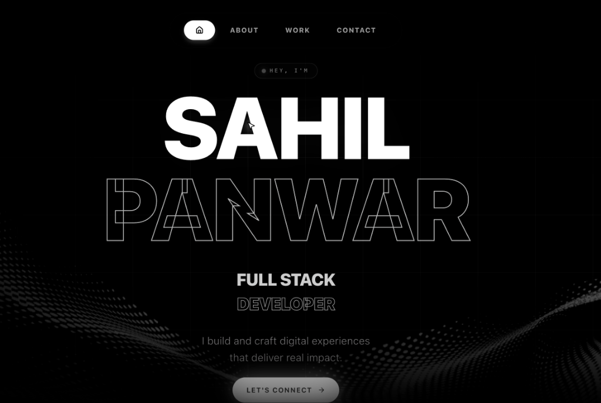

# ⚡ Sahil Panwar — Developer Portfolio

<div align="center">

  

  <br />

  [](https://portfolio-two-swart-31.vercel.app)
  [](https://nextjs.org/)
  [](https://react.dev/)
  [](https://www.typescriptlang.org/)
  [](https://tailwindcss.com/)
  [](https://www.framer.com/motion/)

  <p align="center">
    <strong>A high-performance, aesthetically crafted, modern developer portfolio built with Next.js 15, React 19, TypeScript, Tailwind CSS v4, and 3D WebGL animations.</strong>
  </p>

  <p align="center">
    <a href="https://portfolio-two-swart-31.vercel.app" target="_blank"><strong>🌐 View Live Demo »</strong></a>
    &nbsp;&middot;&nbsp;
    <a href="#-getting-started"><strong>🚀 Getting Started »</strong></a>
    &nbsp;&middot;&nbsp;
    <a href="#-tech-stack"><strong>🛠 Tech Stack »</strong></a>
  </p>

</div>

---

## 📖 Table of Contents

- [Overview](#-overview)
- [Key Features](#-key-features)
- [Tech Stack](#-tech-stack)
- [Project Architecture](#-project-architecture)
- [Getting Started](#-getting-started)
- [Environment Variables](#-environment-variables)
- [Deployment](#-deployment)
- [Contact & Connect](#-contact--connect)

---

## 🌟 Overview

Welcome to my personal developer portfolio! This web application showcases my projects, technical skill set, work experience, and personal background. Built with cutting-edge web technologies, it delivers a ultra-fluid dark-mode user experience with smooth momentum scrolling, glassmorphism UI elements, and interactive 3D WebGL animations.

---

## ✨ Key Features

- **🚀 Next.js 15 App Router & Server Actions**: Ultra-fast Server-Side Rendering (SSR) and type-safe server actions for seamless form handling.
- **🎨 Glassmorphism & Dark Aesthetic**: Modern visual aesthetics featuring ambient glows, backdrop blurs, and dynamic gradient accents.
- **🖼️ Interactive Project Showcase**: Carousel and grid layouts highlighting top projects with live links, preview screenshots, and tech tags.
- **🛠️ Tech Arsenal Matrix**: Categorized grid of technologies (Frontend, Backend, Tools & Databases) with hover effects and skill badges.
- **✉️ Serverless Contact Form**: Direct email delivery powered by [Resend](https://resend.com) API and Next.js Server Actions.
- **🌀 Smooth Scroll & Micro-Animations**: Smooth physics scrolling powered by Lenis, combined with Framer Motion scroll reveals.
- **📱 100% Fully Responsive**: Pixel-perfect view across all screen resolutions—mobile, tablet, and ultra-wide desktops.

---

## 🛠 Tech Stack

### Core Framework & Language
- **[Next.js 15](https://nextjs.org/)** — React framework with App Router architecture
- **[React 19](https://react.dev/)** — UI Library for component-driven development
- **[TypeScript](https://www.typescriptlang.org/)** — Strict type safety and autocompletion

### Styling & UI
- **[Tailwind CSS v4](https://tailwindcss.com/)** — Utility-first CSS framework
- **[Lucide React](https://lucide.dev/)** — Beautiful & consistent iconography
- **[Radix UI](https://www.radix-ui.com/)** — Unstyled, accessible UI primitives

### Motion & 3D Experience
- **[Framer Motion](https://www.framer.com/motion/)** — Declarative animations and page transitions
- **[Three.js](https://threejs.org/) & [React Three Fiber](https://r3f.docs.pmnd.rs/)** — Interactive 3D graphics in WebGL
- **[Lenis](https://lenis.darkroom.engineering/)** — Smooth momentum scroll system
- **[GSAP](https://gsap.com/)** — High-performance timeline animations

### Backend & Integrations
- **[Resend API](https://resend.com/)** — Serverless email dispatching via Next.js Server Actions

---

## 📂 Project Architecture

```text
portfolio/
├── app/
│   ├── actions/
│   │   └── sendEmail.ts         # Next.js Server Action for contact form handling via Resend
│   ├── components/
│   │   ├── about.tsx            # About Me section with bio & highlights
│   │   ├── contact.tsx          # Contact section with interactive form
│   │   ├── footer.tsx           # Footer with social links & copyright
│   │   ├── hero.tsx             # Main hero section with call-to-actions
│   │   ├── navbar.tsx           # Responsive navigation bar with mobile drawer
│   │   ├── projects.tsx         # Interactive project showcase carousel
│   │   ├── tech-stack.tsx       # Tech arsenal matrix and categories
│   │   └── ui/                  # Reusable UI primitives (buttons, cards, inputs)
│   ├── globals.css              # Global styles, Tailwind v4 imports, custom scrollbar
│   ├── layout.tsx               # Root layout, metadata & Lenis smooth scroll wrapper
│   └── page.tsx                 # Home page assembling all layout sections
├── public/
│   ├── preview.png              # Portfolio UI preview screenshot
│   ├── background.jpg           # Hero background visual asset
│   └── projects/                # Project preview screenshots
├── .env.local                   # Local environment variables (gitignored)
├── .gitignore                   # Standard gitignore configurations
├── next.config.ts               # Next.js configuration
├── package.json                 # Project manifest & dependencies
├── tsconfig.json                # TypeScript compiler settings
└── README.md                    # Project documentation
```

---

## 🚀 Getting Started

Follow these steps to run the portfolio locally on your machine.

### Prerequisites

Ensure you have the following installed:
- **Node.js**: `v18.17.0` or higher
- **npm** / **yarn** / **pnpm**

### Installation

1. **Clone the repository:**
   ```bash
   git clone https://github.com/sahilsinghpanwar/PORTFOLIO.git
   cd PORTFOLIO
   ```

2. **Install dependencies:**
   ```bash
   npm install
   ```

3. **Configure Environment Variables:**
   Create a `.env.local` file in the root directory (refer to [Environment Variables](#-environment-variables)).

4. **Run the Development Server:**
   ```bash
   npm run dev
   ```

5. **Open in Browser:**
   Navigate to [http://localhost:3000](http://localhost:3000) to view the app live.

---

## 🔐 Environment Variables

Create a `.env.local` file in the project root with the following keys:

```env
# Resend API Key for sending contact form messages
RESEND_API_KEY=re_your_resend_api_key_here

# Notification Gmail (Optional - defaults to sahilpanwar0305@gmail.com)
NOTIFICATION_GMAIL=sahilpanwar0305@gmail.com
```

---

## 📦 Production & Deployment

### Build locally
To verify production readiness:
```bash
npm run build
npm run start
```

### Deploying to Vercel
1. Push your code to your GitHub repository.
2. Import your repository into [Vercel](https://vercel.com).
3. Add your `RESEND_API_KEY` under **Environment Variables**.
4. Click **Deploy**. Vercel will automatically build and deploy your Next.js application.

---

## 📬 Contact & Connect

- 🌐 **Live Portfolio:** [portfolio-two-swart-31.vercel.app](https://portfolio-two-swart-31.vercel.app)
- 💻 **GitHub:** [@sahilsinghpanwar](https://github.com/sahilsinghpanwar)
- 📧 **Email:** [sahilpanwar0305@gmail.com](mailto:sahilpanwar0305@gmail.com)

---

<div align="center">
  <p>Crafted with ❤️ by <strong>Sahil Panwar</strong></p>
</div>
